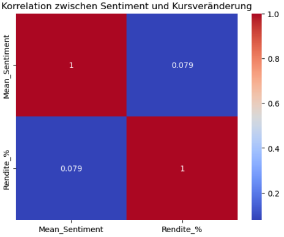
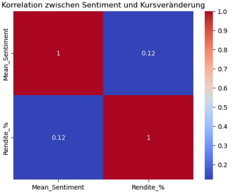

# Projekt: Einfluss von Finanznachrichten auf Aktienkurse

**Unternehmen:** Allianz, Rheinmetall, SAP, Siemens, Telekom  

## Ziel des Projekts
Untersuchung, ob und in welchem Ausmaß sich das Sentiment von Finanznachrichten (positiv, neutral, negativ) auf die kurzfristige Kursentwicklung von fünf bedeutenden deutschen Unternehmen auswirkt.  

Die Analyse kombiniert historische Kursdaten mit korrespondierenden Finanznachrichten und liefert sowohl deskriptive als auch explorative Erkenntnisse, die visuell aufbereitet werden.  

---

## Datenquellen
> **Hinweis:** Die im Projekt verwendeten Datensätze sind **nicht im Repository enthalten** und müssen extern bereitgestellt werden.  

- **Finanznachrichten:**  
  - Quelle: [finanznachrichten.de](https://www.finanznachrichten.de/)  
  - Zeitraum: 01.01.2020 – 09.06.2025  
  - Erwartetes Format: CSV mit den Spalten  
    - `Datum` (YYYY-MM-DD)  
    - `Titel`  
    - `Quelle`  
    - `Sprache`  

- **Aktienkursdaten:**  
  - Quelle: [Yahoo Finance](https://finance.yahoo.com/) via [`yfinance`](https://pypi.org/project/yfinance/)  
  - Unternehmen: Allianz, Rheinmetall, SAP, Siemens, Telekom  
  - Zeitraum: 01.01.2020 – 10.06.2025  
  - Spalten: `Date`, `Ticker`, `Open`, `High`, `Low`, `Close`, `Volume`  

---

## Projektstruktur

```
notebooks/
├── 01_Finanznachrichten.ipynb # Laden, Bereinigung, Sentimentanalyse der Finanznachrichten
├── 02_NachrichtenAktien.ipynb # Laden der Aktienkurse, Merge mit Sentiment, Korrelationsanalyse
data/ # (nicht im Repo) - Nutzer*in stellt eigene Daten bereit
visuals/ # Plots
requirements.txt # benötigte Python-Bibliotheken
```


---

## Methoden & Technologien
- **Python**: pandas, numpy, matplotlib, seaborn, plotly  
- **Natural Language Processing (NLP):** Sentimentanalyse mit HuggingFace `transformers`  
- **Finanzdaten:** Aktienkurse über `yfinance`  
- **Statistik:** Korrelationsanalyse, explorative Datenanalyse  
- **Jupyter Notebooks** zur interaktiven Auswertung  

---

## Installation

1. Repository klonen:
   ```bash
   git clone https://github.com/InkenOk/FinanznachrichtenAktien.git
   cd FinanznachrichtenAktien

2. Virtuelle Umgebung erstellen und aktivieren (optional, empfohlen):
   ```bash
   python -m venv venv
   source venv/bin/activate  # macOS/Linux
   venv\Scripts\activate   # Windows
   ```

3. Abhängigkeiten installieren:
   ```bash
   pip install -r requirements.txt
   ```
   
---

## Nutzung

1. Eigene CSV-Dateien in den `data/`-Ordner legen:
   - `FINANZNEWS_DATEI.csv` – Finanznachrichten (UTF-8 kodiert)
   - `AKTIENKURSE_DATEI.csv` – Aktienkursdaten

2. Jupyter Notebook starten:
   ```bash
   jupyter notebook
   ```

3. Notebooks in folgender Reihenfolge ausführen:
   1. **01_Finanznachrichten.ipynb** – Datenvorbereitung, Sentimentanalyse
   2. **02_NachrichtenAktien.ipynb** – Kursdaten, Merge, Korrelationsanalyse
  
---

## Ergebnisse

Korrelationsanalyse - alle Daten:Das Ergebnis der Korrelationsanalyse zeigt einen schwachen positiven Zusammenhang. Die Korrelation zwischen Sentiment und Kursveränderung beträgt **0,079**. 



Korrelationsanalyse - Sentiment und Tagesrendite nur für Fälle, bei denen am gleichen Tag Aktienkurse vorliegen (Close ≠ NA): Das Ergebnis zeigt eine **Korrelation von 0,12**, was auf einen leicht stärkeren, aber weiterhin schwachen positiven Zusammenhang hinweist als in der Gesamtauswertung.



Die Korrelation zwischen dem Sentiment in Finanznachrichtentiteln und der Tagesrendite der Aktien ist bei allen Unternehmen positiv, aber schwach. Der stärkste Zusammenhang besteht bei Rheinmetall (r=0.19). Hier scheint das Sentiment etwas stärker auf die Tagesrendite einzuwirken. Allianz, SAP und Siemens zeigen einen schwachen, leicht positiven Zusammenhang. Bei der Telekom ist der Zusammenhang sehr schwach (r=0.03).

---

## Lizenz

Dieses Projekt steht unter der MIT-Lizenz.

---

## Quellen

Finanznachrichten: finanznachrichten.de
Aktienkursdaten: Yahoo Finance via yfinance